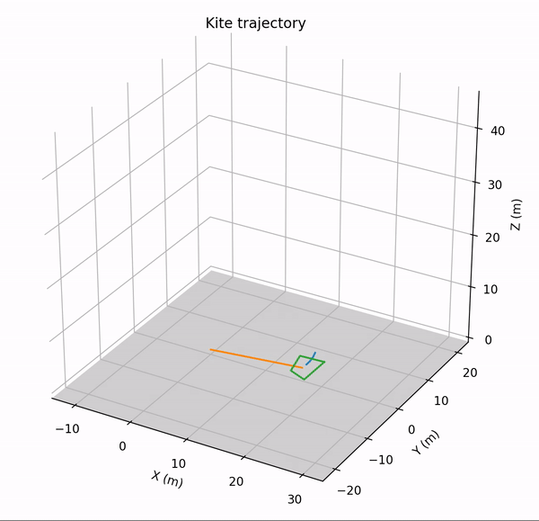

# kiteTrajOpt

Final Project for MIT Underactuated Robotics Course 6.832. Optimizing trajectories for power-generating kite systems

[Watch the video](https://www.youtube.com/watch?v=UNLKtJ9KCG8) | [Read the paper](https://github.com/IzzyBrand/kiteTrajOpt/blob/master/report.pdf)

